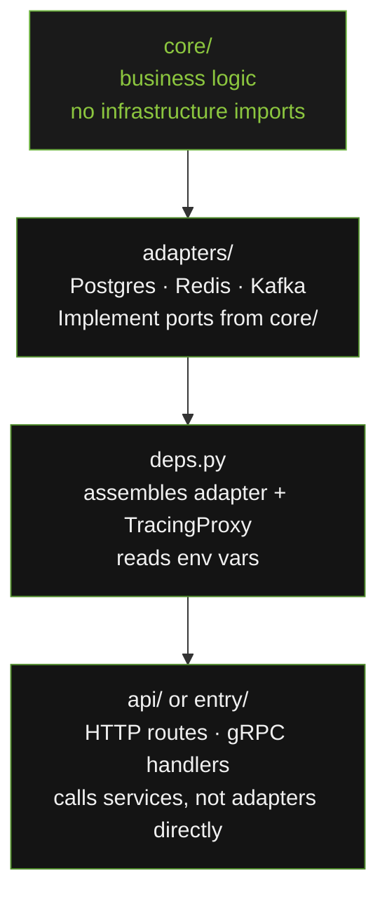

# How It Works

`openframe-core` enforces hexagonal architecture (Ports and Adapters). This page explains the pattern in plain language.

---

## The Core Idea

Business logic lives in the centre. Infrastructure lives on the outside. The centre never imports from the outside.



---

## Ports: What the Contract Is

A port is a Python Protocol — a structural interface. `BaseRepository[T]` says: "whatever object I call `get(entity_id)` on must return `T | None`." It does not say anything about Postgres, MongoDB, or an in-memory dict.

```python
# core/ defines the contract
class BaseRepository(Protocol[T]):
    async def get(self, entity_id: str) -> T | None: ...
```

---

## Adapters: How the Contract Is Fulfilled

An adapter implements the port for a specific backend. It knows about asyncpg. It translates between asyncpg's API and the port's API. If asyncpg raises an error, the adapter catches it and raises `AdapterQueryError` instead.

```python
# adapter knows about asyncpg — core/ does not
class PostgresRepository:
    async def get(self, entity_id: str) -> Item | None:
        try:
            row = await self._pool.fetchrow(query, entity_id)
            return Item(**row) if row else None
        except asyncpg.PostgresError as exc:
            raise AdapterQueryError("get failed", "postgres", "get", exc) from exc
```

---

## TracingProxy: Telemetry Without Code

`TracingProxy` wraps the adapter. The service layer calls `traced_repo.get(entity_id)` — it has no idea a span is being created.

```python
repo = PostgresRepository(settings)
traced_repo = TracingProxy(repo, prefix="repository.item")
# Every call to traced_repo.get() creates span "repository.item.get"
```

---

## deps.py: The Assembly Point

One file reads env vars, constructs the adapter, wraps it with `TracingProxy`, and hands it to the route handlers. The route handlers call the service layer. The service layer calls the repository. None of them know about Postgres.

---

## What This Means Practically

Swap Postgres for MongoDB: change one env var (`PERSISTENCE_BACKEND=mongo`), change one line in `deps.py`, install `openframe-adapters-db-mongo`. Zero changes to business logic.

Run tests without a database: use an in-memory dict that satisfies `BaseRepository` structurally. No mocking required.
