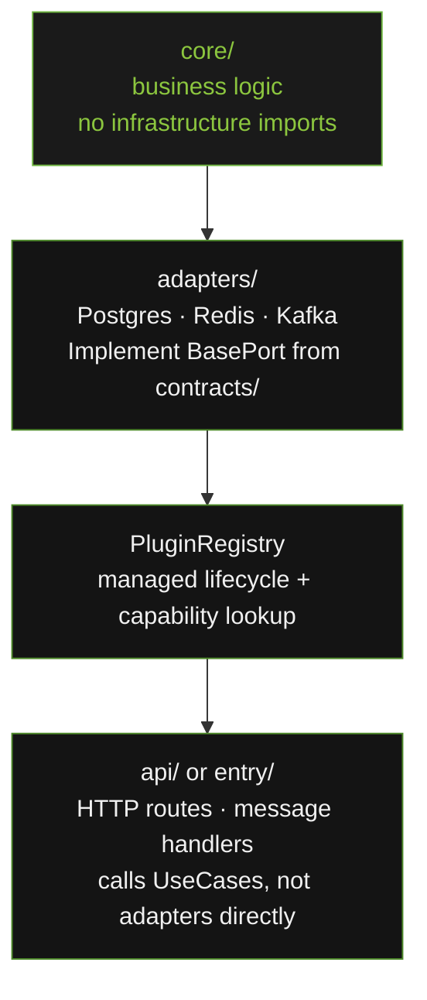

# How It Works

`openframe-core` enforces hexagonal architecture (Ports and Adapters). This page explains the pattern in plain language.

---

## The Core Idea

Business logic lives in the centre. Infrastructure lives on the outside. The centre never imports from the outside.



---

## Two Sides of the Hexagon

`openframe-core` v3 models both sides of the hexagon explicitly:

- **Outbound (driven) side** — `ports/`: `BaseRepository`, `BaseProducer`, `BaseConsumer`. These are what business logic calls to reach the outside world.
- **Inbound (driving) side** — `inbound/`: `UseCase`, `CommandHandler`, `QueryHandler`. These are what inbound adapters (HTTP routes, message handlers, CLI commands) call into business logic.

Both sides are built on `contracts/` — the apex module that defines `BasePort`, `Identity`, `Lifecycle`, and `Capability`.

---

## Ports: What the Contract Is

A port is a Python `Protocol` — a structural interface. `BaseRepository[T]` says: "whatever object I call `get(entity_id)` on must return `T | None`." It does not say anything about Postgres, MongoDB, or an in-memory dict.

Every port in v3 is also a `BasePort` — it has `name`, `version`, `capability`, `initialize`, `shutdown`, and `health`. An adapter that implements `BaseRepository` is automatically lifecycle-aware and registry-registrable with no extra wrapper code.

```python
# contracts/ defines BasePort; ports/ adds domain methods
class BaseRepository(BasePort, Protocol[T]):
    async def get(self, entity_id: str) -> T | None: ...
    # ... + name, version, capability, initialize, shutdown, health from BasePort
```

---

## Adapters: How the Contract Is Fulfilled

An adapter implements the port for a specific backend. It knows about asyncpg. It translates between asyncpg's API and the port's API. If asyncpg raises an error, the adapter catches it and raises `AdapterQueryError` (an `OpenFrameError` subclass) instead.

```python
# adapter knows about asyncpg — core/ does not
class PostgresRepository:
    name = "postgres-main"
    version = "1.0.0"
    capability = Capability.PERSISTENCE

    async def initialize(self, context: PluginContext) -> None:
        self._pool = await asyncpg.create_pool(context.config["dsn"])

    async def get(self, entity_id: str) -> Item | None:
        try:
            row = await self._pool.fetchrow(query, entity_id)
            return Item(**row) if row else None
        except asyncpg.PostgresError as exc:
            raise AdapterQueryError("get failed", "postgres", "get", exc) from exc
```

---

## PluginRegistry: Managed Lifecycle

`PluginRegistry` initialises ports in order, shuts them down in reverse, and provides type-safe `Capability` lookups. A "plugin" is just a registered `BasePort`.

```python
registry = PluginRegistry()
registry.register(PostgresRepository(), config={"dsn": "..."})
await registry.initialize_all()            # calls repo.initialize(PluginContext)

repo = registry.get(Capability.PERSISTENCE)   # strict Capability enum lookup
traced_repo = TracingProxy(repo, prefix="repository.item")
```

---

## TracingProxy: Telemetry Without Code

`TracingProxy` wraps the adapter. The service layer calls `traced_repo.get(entity_id)` — it has no idea a span is being created.

```python
repo = PostgresRepository()
traced_repo = TracingProxy(repo, prefix="repository.item")
# Every call to traced_repo.get() creates span "repository.item.get"
```

---

## What This Means Practically

**Swap backends**: change one config value, change one registry registration, install the new adapter package. Zero changes to business logic.

**Test without infrastructure**: use `InMemoryRepository` (from `openframe.core.testing`) — it satisfies `BaseRepository` and `BasePort` structurally. No mocking required, no running database.

**Consistent lifecycle everywhere**: every adapter — Postgres, Redis, Kafka — is initialised, health-checked, and shut down through the same `Lifecycle` contract. Startup and teardown are deterministic.
