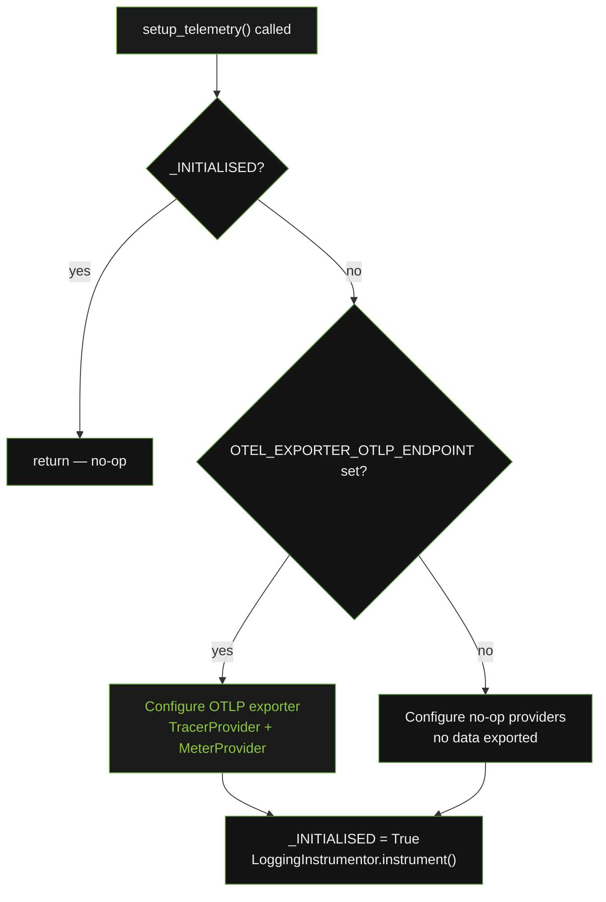
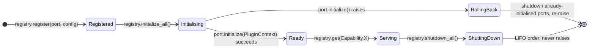

# Component Lifecycle

The lifecycle of `openframe-core` components across application startup, request handling, and shutdown.

---

## Startup Sequence

The following diagram shows the order in which core components are initialised when a template application starts. `PluginRegistry` is the managed lifecycle coordinator — every port is initialised through it, and `health()` is the single health primitive (replacing the old `ping()`/`is_ready()` pair).

```mermaid
stateDiagram-v2
    direction LR
    [*] --> TelemetryInit : lifespan startup
    TelemetryInit --> SettingsInit : setup_telemetry()
    SettingsInit --> RegistryBuild : PostgresSettings() / RedisSettings()
    RegistryBuild --> PortInit : registry.register(port, config=…)
    PortInit --> HealthCheck : port.initialize(PluginContext)
    HealthCheck --> ProxyWrap : port.health() → PluginStatus.READY
    ProxyWrap --> Ready : TracingProxy(port, prefix)
    Ready --> [*] : lifespan shutdown → registry.shutdown_all()
```



---

## setup_telemetry() Idempotency

`setup_telemetry()` uses a module-level `_INITIALISED` boolean guard. The second call in the same process returns immediately without reinitialising any providers.



!!! warning
    Tests must reset `_INITIALISED = False` and call `get_tracer.cache_clear()` between runs. Without this, the first test's `TracerProvider` leaks into all subsequent tests. See [conftest.py](../../code/modules/telemetry.md) for the reset fixture.

---

## PluginRegistry Lifecycle

`PluginRegistry` is the single managed lifecycle coordinator. Ports are registered with optional config, initialised in order, and shut down in reverse (LIFO) order. If any port's `initialize()` raises, the registry rolls back already-initialised ports before propagating the error.



---

## TracingProxy Method Resolution

`TracingProxy` resolves the wrapped method on every async call — not once at first access. This is the critical design property that makes the proxy safe for reconnecting adapters.

```mermaid
flowchart TD
    Access["proxy.method_name accessed"]
    Cache{name in _cache?}
    ReturnCached["return cached closure"]
    Probe["probe = getattr(wrapped, name)"]
    IsAsync{asyncio.iscoroutinefunction(probe)?}
    ReturnSync["return probe directly\nno span, no cache"]
    BuildClosure["build _traced closure\ncache[name] = _traced"]
    ReturnClosure["return _traced"]
    CallTime["_traced(*args, **kwargs) called"]
    Resolve["current = getattr(wrapped, name)\nresolved fresh every call"]
    Span["start_as_current_span(prefix.name)"]
    Invoke["await current(*args, **kwargs)"]

    Access --> Cache
    Cache -->|yes| ReturnCached
    Cache -->|no| Probe
    Probe --> IsAsync
    IsAsync -->|no| ReturnSync
    IsAsync -->|yes| BuildClosure
    BuildClosure --> ReturnClosure
    ReturnClosed --> CallTime
    CallTime --> Resolve
    Resolve --> Span
    Span --> Invoke

    style Access fill:#1a1a1a,color:#F0F0F0,stroke:#6DB33F
    style ReturnCached fill:#141414,color:#F0F0F0,stroke:#4E8A2A
    style ReturnSync fill:#141414,color:#F0F0F0,stroke:#4E8A2A
    style BuildClosure fill:#1a1a1a,color:#8CC63F,stroke:#6DB33F
    style Resolve fill:#1a1a1a,color:#8CC63F,stroke:#6DB33F
    style Span fill:#141414,color:#F0F0F0,stroke:#4E8A2A
    style Cache fill:#141414,color:#F0F0F0,stroke:#4E8A2A
    style IsAsync fill:#141414,color:#F0F0F0,stroke:#4E8A2A
    style Invoke fill:#141414,color:#F0F0F0,stroke:#4E8A2A
    style Probe fill:#141414,color:#F0F0F0,stroke:#4E8A2A
    style ReturnClosure fill:#141414,color:#F0F0F0,stroke:#4E8A2A
    style CallTime fill:#141414,color:#F0F0F0,stroke:#4E8A2A
