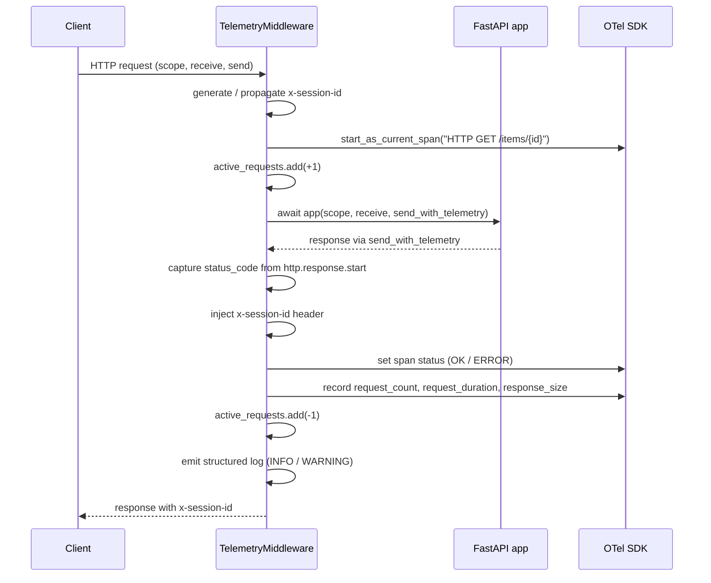
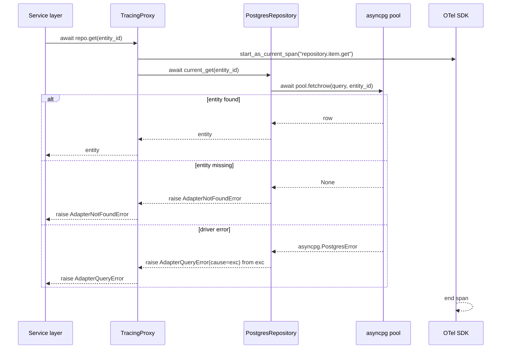
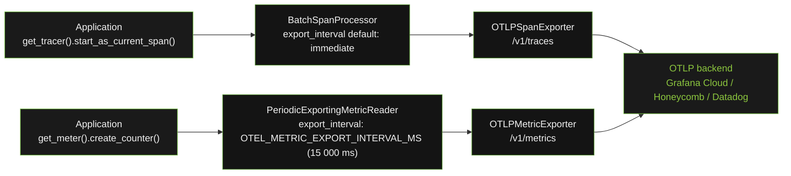

# Data Flows

How data moves through `openframe-core` components during a request, an adapter operation, and a telemetry export cycle.

---

## HTTP Request Flow

Every inbound HTTP request passes through `TelemetryMiddleware` before reaching the application. The middleware intercepts the ASGI `send` callable to capture the response status code without buffering.

---

## Adapter Operation Flow

An adapter call flows from the service layer through `TracingProxy` to the real adapter, with `AdapterError` wrapping any driver exception.

---

## OTel Export Cycle

`openframe-core` configures two exporters at startup. Traces are batched and exported asynchronously; metrics are exported on a periodic interval.

