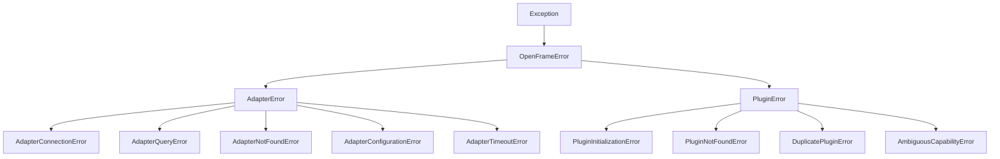

# Error Taxonomy

`openframe-core` raises a single, unified exception hierarchy rooted at
`OpenFrameError` (ADR-006 error-handling schema). Every error the ecosystem
raises — the adapter family (backend/infrastructure failures) and the plugin
family (registry/lifecycle failures) — derives from it, so a single
`except OpenFrameError` is a catch point for the whole platform.

The hierarchy lives in one package,
[`openframe/core/exceptions/`](../../../openframe/core/exceptions/); when this
page and the code disagree, the code is authoritative.

---

## Hierarchy



---

## The `OpenFrameError` root

Every error carries the same structured, serialisation-ready fields:

| Field | Type | Purpose |
|---|---|---|
| `code` | `str` | Namespaced `domain.kind` identity (survives the wire) |
| `message` | `str` | Human-readable description |
| `severity` | `Severity` | `WARNING` / `ERROR` / `CRITICAL` |
| `retryable` | `bool` | Whether the operation is safe to retry |
| `correlation_id` | `str \| None` | Trace id, stamped by an upper layer |
| `context` | `dict[str, Any]` | Structured, non-PII detail (mutable) |
| `cause` | `Exception \| None` | Underlying exception (chained with `raise ... from`) |

`severity` and `retryable` are carried as **data** so retry logic, gateways,
and middleware can act on them without an `isinstance` ladder over every
concrete error class.

---

## Codes: the `domain.kind` convention

Every code is a lowercase `"<domain>.<kind>"` string. `ErrorCode` enumerates
only the codes owned by `openframe-core`:

| Code | Class | `retryable` |
|---|---|---|
| `openframe.error` | `OpenFrameError` | `False` |
| `adapter.error` | `AdapterError` | `False` |
| `adapter.connection` | `AdapterConnectionError` | `True` |
| `adapter.query` | `AdapterQueryError` | `False` |
| `adapter.not_found` | `AdapterNotFoundError` | `False` |
| `adapter.configuration` | `AdapterConfigurationError` | `False` |
| `adapter.timeout` | `AdapterTimeoutError` | `True` |
| `plugin.error` | `PluginError` | `False` |
| `plugin.initialization` | `PluginInitializationError` | `False` |
| `plugin.not_found` | `PluginNotFoundError` | `False` |
| `plugin.duplicate` | `DuplicatePluginError` | `False` |
| `plugin.capability_ambiguous` | `AmbiguousCapabilityError` | `False` |

### Decentralised ownership

Unlike the closed `Capability` enum, error codes are **decentralised**. A
downstream package does **not** extend `ErrorCode` — it declares its own plain
`"<domain>.<kind>"` strings following the same convention, and its error
classes derive from `OpenFrameError`:

```python
from openframe.core.exceptions import OpenFrameError, Severity

class AIError(OpenFrameError):
    """Root for all openframe-ai errors."""

class RateLimitedError(AIError):
    def __init__(self, message, *, provider, retry_after):
        super().__init__(
            message,
            code="ai.rate_limited",     # namespaced, no core edit needed
            severity=Severity.WARNING,
            retryable=True,
            context={"provider": provider, "retry_after": retry_after},
        )
```

`except OpenFrameError` catches this `ai.rate_limited` error even though core
has never heard of `openframe-ai`. New packages never widen anyone's `except`
tuple. Error codes are a stable contract within a major version.

---

## Wrapping discipline

`except OpenFrameError` catches everything the ecosystem raises *deliberately*.
It does **not** catch raw third-party driver exceptions. Adapters must
translate driver errors into an `AdapterError` at their boundary:

```python
try:
    await conn.execute(query)
except SomeDriverError as exc:
    raise AdapterQueryError(
        "Query failed", adapter="postgres", operation="get", cause=exc
    ) from exc
```

The original driver exception is preserved on `cause` for diagnostics; the
catchable type is the openframe one. This wrapping is verified by
`PortContractTests`.

---

## Flow into telemetry

Because `exceptions` is the lowest layer in the DAG, an error never imports
telemetry. Instead, `telemetry.record_error` (which legally imports
`OpenFrameError`) reads the error's data and records it, and each boundary
seam calls it:

- `TracingProxy` — outbound adapter calls
- `TelemetryMiddleware` — inbound HTTP requests
- `PluginRegistry` — startup/shutdown lifecycle (outside any request span)

`record_error` sets `error.code` / `error.severity` / `error.retryable` span
attributes, records the exception, stamps `correlation_id` back onto the
error, and increments the `openframe.error.count` metric **exactly once** per
error object (deduped across seams; only the low-cardinality `error.code` is
used as a metric label). See
[ADR-006](adrs/adr-006-unified-port-lifecycle.md) for the full rationale.
