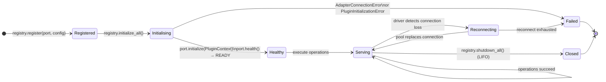

# Adapter Lifecycle

Every adapter in the OpenFrame v3 ecosystem follows the same four-phase lifecycle managed by `PluginRegistry`: `initialize`, `health`, execute, `shutdown`. Health is a single `Lifecycle.health() -> PluginHealth` call — the old separate `ping()`/`is_ready()` pair is gone.

---

## Lifecycle Phases



---

## Reconnect Safety

When a connection pool replaces a broken connection, the driver may replace its own internal method objects. `TracingProxy` is designed for this — it resolves the method via `getattr(wrapped, name)` on every async call, never from a snapshot captured at first access.

```python
async def _traced(*args, **kwargs):
    # Re-resolves on every call — never a stale snapshot
    current = getattr(object.__getattribute__(self, "_wrapped"), name)
    with get_tracer().start_as_current_span(f"{prefix}.{name}"):
        return await current(*args, **kwargs)
```

→ See [tracing flow](tracing-flow.md) for the full span creation sequence.

---

## Health Contract

`Lifecycle.health()` must never raise — return `PluginHealth(status=PluginStatus.UNAVAILABLE, message="<reason>")` on any failure. This is the single health primitive in v3; there is no separate `ping()` or `is_ready()`.

```python
async def health(self) -> PluginHealth:
    try:
        await self._pool.fetchval("SELECT 1")
        return PluginHealth(status=PluginStatus.READY)
    except Exception as exc:
        return PluginHealth(
            status=PluginStatus.UNAVAILABLE,
            message=str(exc),
        )
```

Liveness vs. readiness granularity is expressed in `PluginStatus` and `PluginHealth.details`, not in separate methods:

```python
# Distinguish readiness detail in PluginHealth.details
return PluginHealth(
    status=PluginStatus.READY,
    details={"ping_ms": 2.1, "schema_ok": True},
)
```

→ See [ports module](../../../code/modules/ports.md) for `PluginHealth`, `PluginStatus`, `Lifecycle`.
