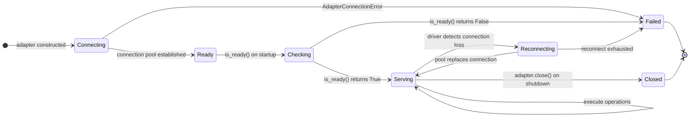

# Adapter Lifecycle

Every adapter in the OpenFrame ecosystem follows the same four-phase lifecycle: connect, health check, execute, close.

---

## Lifecycle Phases



---

## Reconnect Safety

When a connection pool replaces a broken connection, the driver may replace its own internal method objects. `TracingProxy` is designed for this — it resolves the method via `getattr(wrapped, name)` on every async call, never from a snapshot captured at first access.

```python
async def _traced(*args, **kwargs):
    # Re-resolves on every call — never a stale snapshot
    current = getattr(object.__getattribute__(self, "_wrapped"), name)
    with get_tracer().start_as_current_span(f"{prefix}.{name}"):
        return await current(*args, **kwargs)
```

→ See [tracing flow](tracing-flow.md) for the full span creation sequence.

---

## Health Check Contract

`HealthCheck.ping()` must never raise — return `False` on any failure. `HealthCheck.is_ready()` has the same contract. This is enforced by convention; the Protocol does not enforce it at the type level.

```python
async def ping(self) -> bool:
    try:
        await self._pool.fetchval("SELECT 1")
        return True
    except Exception:
        return False  # never raise
```

→ See [health module](../../../code/modules/health.md) for the full Protocol definition.
