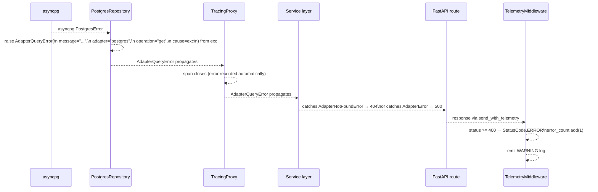

# Error Propagation

Every adapter in the OpenFrame ecosystem raises only `AdapterError` subclasses — never raw driver exceptions. This page shows how an error travels from the database driver to the HTTP response.

---

## Error Flow



---

## Exception Hierarchy

```
AdapterError (base)
├── AdapterConnectionError   — backend unreachable
├── AdapterQueryError        — operation failed post-connection
├── AdapterNotFoundError     — entity does not exist
├── AdapterConfigurationError— missing / invalid config
└── AdapterTimeoutError      — operation exceeded timeout
```

Service layers catch at the appropriate specificity:

```python
try:
    entity = await repo.get(entity_id)
except AdapterNotFoundError:
    raise HTTPException(status_code=404, detail="not found")
except AdapterError:
    raise HTTPException(status_code=500, detail="internal error")
```

---

## str() Format

`AdapterError.__str__` produces a structured string — not a raw tuple repr:

```
[postgres.get] entity not found
[postgres.create] insert failed — caused by: null constraint violation
```

The format is `[adapter.operation] message` with an optional `— caused by: <cause>` suffix when a cause is present.

→ See [exceptions module](../../../code/modules/exceptions.md) for the full class reference.
