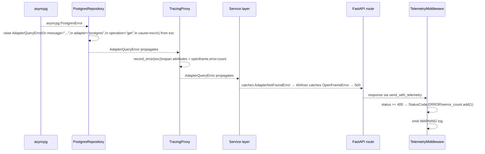

# Error Propagation

Every adapter in the OpenFrame ecosystem raises only `OpenFrameError` subclasses — never raw driver exceptions. `record_error()` is called at each boundary seam to record structured error data on the active OTel span. This page shows how an error travels from the database driver to the HTTP response.

---

## Error Flow



---

## Exception Hierarchy

```
OpenFrameError (root)
├── AdapterError
│   ├── AdapterConnectionError   — backend unreachable           (retryable=True)
│   ├── AdapterQueryError        — operation failed post-connection
│   ├── AdapterNotFoundError     — entity does not exist
│   ├── AdapterConfigurationError— missing / invalid config
│   └── AdapterTimeoutError      — operation exceeded timeout    (retryable=True)
└── PluginError
    ├── PluginInitializationError— initialize() failed
    ├── PluginNotFoundError      — no port for capability
    ├── DuplicatePluginError     — same port registered twice
    └── AmbiguousCapabilityError — >1 port for capability in get()
```

Service layers catch at the appropriate specificity:

```python
from openframe.core.exceptions import (
    OpenFrameError,
    AdapterNotFoundError,
    AdapterError,
)

try:
    entity = await repo.get(entity_id)
except AdapterNotFoundError:
    raise HTTPException(status_code=404, detail="not found")
except AdapterError as exc:
    if exc.retryable:
        await backoff_and_retry()
    raise HTTPException(status_code=500, detail="internal error")
except OpenFrameError:
    raise HTTPException(status_code=500, detail="internal error")
```

---

## record_error() at Boundary Seams

`record_error()` is called at each openframe boundary — `TracingProxy`, `TelemetryMiddleware`, and `PluginRegistry` — so errors are automatically recorded on the active span without the adapter or service layer needing to call it manually:

```
TracingProxy          → outbound adapter calls
TelemetryMiddleware   → inbound HTTP requests
PluginRegistry        → startup/shutdown lifecycle
```

Each `record_error()` call:
1. Sets `error.code`, `error.severity`, `error.retryable` span attributes
2. Records the exception event on the active span
3. Stamps `exc.correlation_id` with the active trace id
4. Increments `openframe.error.count` metric (deduped — exactly once per error object)

---

## str() Format

`AdapterError.__str__` produces a structured string — not a raw tuple repr:

```
[postgres.get] entity not found
[postgres.create] insert failed — caused by: null constraint violation
```

The format is `[adapter.operation] message` with an optional `— caused by: <cause>` suffix when a cause is present.

→ See [exceptions module](../../../code/modules/exceptions.md) for the full class reference.
→ See [error-taxonomy.md](../error-taxonomy.md) for the `domain.kind` code convention.
