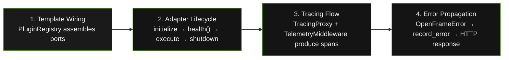

# Package Journey — Overview

A developer installs `openframe-core`, wires it into a template, and serves a request. This section traces that journey end-to-end across four stages.

---

## The Four Stages

| Stage | Page | What it covers |
|---|---|---|
| Template Wiring | [Template Wiring](template-wiring.md) | How `PluginRegistry` and `deps.py` assemble ports with `TracingProxy` |
| Adapter Lifecycle | [Adapter Lifecycle](adapter-lifecycle.md) | `initialize`, `health()`, execute, reconnect, `shutdown` |
| Tracing Flow | [Tracing Flow](tracing-flow.md) | How spans flow from middleware through proxy to adapter |
| Error Propagation | [Error Propagation](error-propagation.md) | How `OpenFrameError` flows through `record_error` to an HTTP response |
