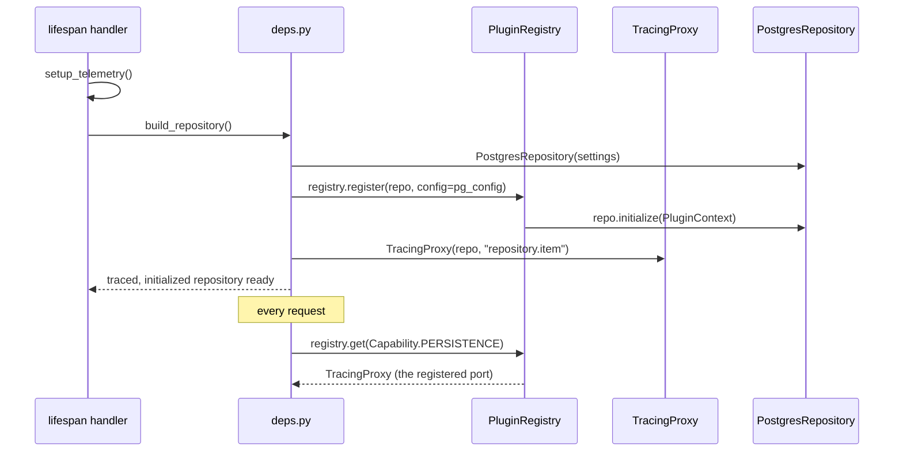

# Template Wiring

`PluginRegistry` is the managed assembly point in every OpenFrame v3 template. It registers ports with their config, initialises them in order (calling `initialize(PluginContext)` on each), and provides type-safe `Capability` lookups. `deps.py` then wraps the resolved port with `TracingProxy`. The service layer never sees a driver import.

---

## Wiring Sequence



---

## Pattern in Code

Every template's `deps.py` follows this structure. The adapter package name changes; the pattern does not.

```python
from openframe.core.ports import Capability, PluginContext, PluginHealth, PluginStatus
from openframe.core.plugins import PluginRegistry
from openframe.core.tracing import TracingProxy
from openframe.adapters.db.postgres import PostgresRepository, PostgresSettings

# Build and register during lifespan startup
registry = PluginRegistry()

async def startup() -> None:
    repo = PostgresRepository(PostgresSettings())
    registry.register(repo, config={"dsn": PostgresSettings().database_url})
    await registry.initialize_all()   # calls repo.initialize(PluginContext)

def get_repository() -> TracingProxy:
    repo = registry.get(Capability.PERSISTENCE)  # strict — raises if >1 match
    return TracingProxy(repo, prefix="repository.item")
```

!!! note
    `registry.get(Capability.PERSISTENCE)` is strict: it raises `AmbiguousCapabilityError` when more than one port shares the requested capability. Use `get_all(Capability.PERSISTENCE)` when multiple ports sharing a capability is the intended configuration (e.g. primary + replica).

→ See [ports module](../../../code/modules/ports.md) for `BasePort`, `Capability`, `PluginContext`.
→ See [plugins module](../../../code/modules/plugins.md) for `PluginRegistry`.
→ See [tracing module](../../../code/modules/tracing.md) for `TracingProxy` implementation.
