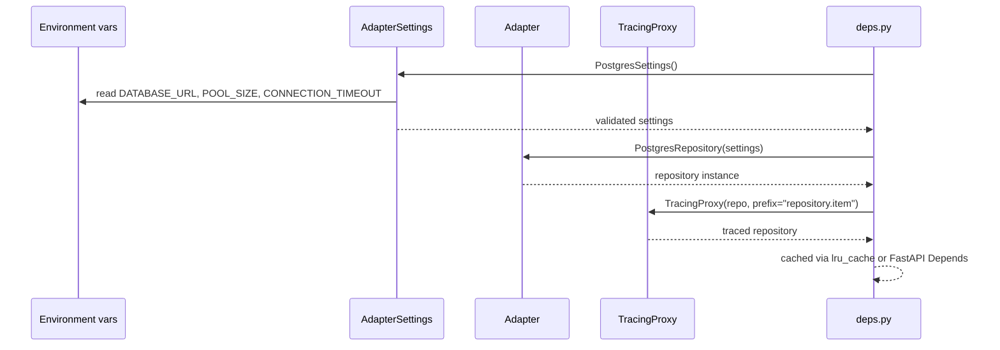

# Template Wiring

`deps.py` is the single assembly point in every OpenFrame template. It reads env vars via settings, constructs the adapter, and wraps it with `TracingProxy`. The service layer never sees a driver import.

---

## Wiring Sequence



---

## Pattern in Code

Every template's `deps.py` follows this structure. The adapter package name changes; the pattern does not.

```python
from functools import lru_cache
from openframe.core.tracing import TracingProxy
from openframe.adapters.db.postgres import PostgresRepository, PostgresSettings

@lru_cache(maxsize=1)
def _get_settings() -> PostgresSettings:
    return PostgresSettings()   # reads env vars, raises ValidationError if missing

@lru_cache(maxsize=1)
def _get_repository() -> PostgresRepository:
    return PostgresRepository(_get_settings())

def get_repository() -> TracingProxy:
    return TracingProxy(_get_repository(), prefix="repository.item")
```

!!! note
    `lru_cache` on the settings and repository means they are constructed once per process. `get_repository()` (without cache) returns a new `TracingProxy` wrapper each time, but the underlying repository is shared — the proxy is stateless.

→ See [ports module](../../../code/modules/ports.md) for `BaseRepository` contract.
→ See [tracing module](../../../code/modules/tracing.md) for `TracingProxy` implementation.
