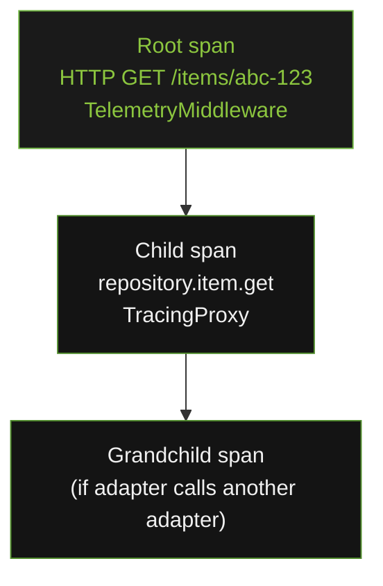

# Tracing Flow

Two components in `openframe-core` produce OTel spans: `TelemetryMiddleware` (one root span per HTTP request) and `TracingProxy` (one child span per async adapter method call).

---

## Span Hierarchy

The OTel context propagation is automatic — `start_as_current_span` in `TracingProxy` picks up the active span set by `TelemetryMiddleware` and creates a child automatically.

---

## Root Span — TelemetryMiddleware

`TelemetryMiddleware` opens a root span at the start of every HTTP request and closes it after the response is sent. Span attributes set:

| Attribute | Source |
|---|---|
| `http.method` | `scope["method"]` |
| `http.target` | `scope["path"]` |
| `http.route` | `scope["route"].path` if available, else `scope["path"]` |
| `http.scheme` | `scope["scheme"]` |
| `http.status_code` | captured from `http.response.start` message |
| `http.user_agent` | `user-agent` request header |
| `net.host.name` | `scope["server"][0]` |
| `http.client_ip` | `x-forwarded-for` header, else `scope["client"][0]` |
| `app.session_id` | `x-session-id` request header or generated UUID |

Span status: `StatusCode.ERROR` for HTTP ≥ 400, `StatusCode.OK` otherwise.

---

## Child Span — TracingProxy

`TracingProxy` opens a child span for every async method call. The span name is `{prefix}.{method_name}`, e.g. `repository.item.get` or `queue.kafka.publish`.

The middleware does **not** call `setup_telemetry()`. Both components call `get_tracer()` directly against whatever `TracerProvider` is currently active — either the one set by `setup_telemetry()` in production, or the `InMemorySpanExporter` provider set by the test fixture.

→ See [middleware module](../../../code/modules/middleware.md) for instrument definitions.
→ See [tracing module](../../../code/modules/tracing.md) for `TracingProxy` implementation.
