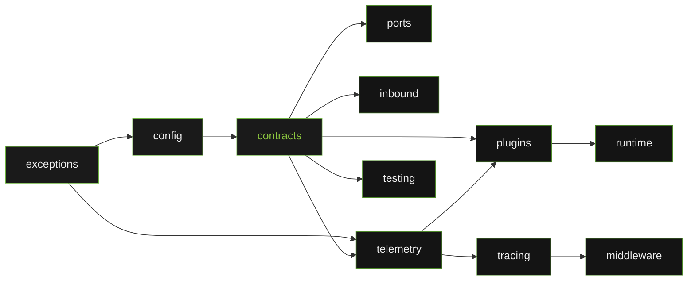
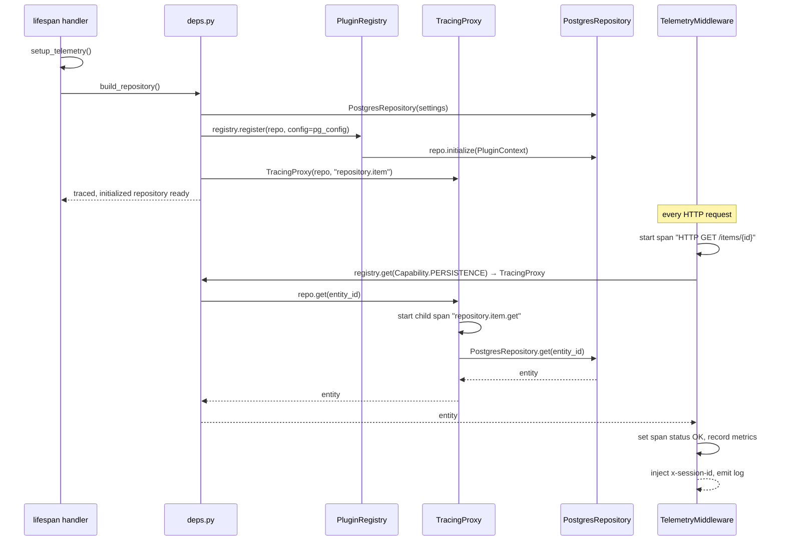
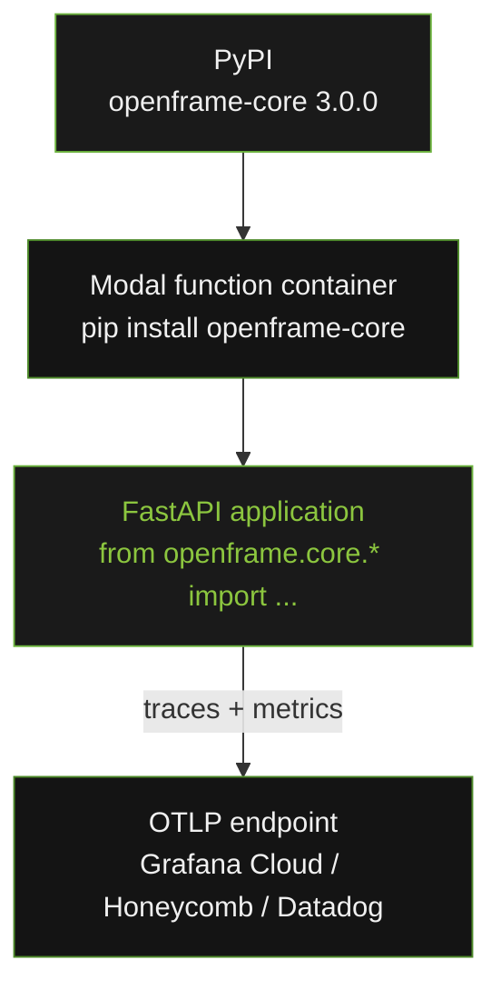

# System Architecture

`openframe-core` is a pure Python foundation package built around a unified
port + lifecycle contract layer (ADR-006). `contracts/` is the apex module
— every other module depends on it, directly or transitively — and both
the outbound (`ports`) and inbound (`inbound`) sides of the hexagon are
first-class citizens of the dependency graph. No module imports from a
module higher in the chain.

---

## Module Dependency DAG

Every arrow in this diagram is a permitted import direction. No reverse
imports exist. There is no standalone `health` node — health is a member
of `contracts` (`Lifecycle.health()` + `PluginHealth`). There is no
standalone `errors` node either — the whole error hierarchy (the adapter
family and the plugin family) lives in the single `exceptions` package,
rooted at `OpenFrameError`. `telemetry` imports `exceptions` so its
`record_error` seam can read an error's structured data without the error
ever importing telemetry.

See [ADR-006](adrs/adr-006-unified-port-lifecycle.md) for the full
rationale, and [capability-taxonomy.md](capability-taxonomy.md) for the
`Capability` enum reference.

---

## Module Inventory

| Module | Public exports | External deps |
|---|---|---|
| `exceptions` | `OpenFrameError` (root), `ErrorCode`, `Severity`, `AdapterError` + 5 subclasses, `PluginError` + 4 subclasses (incl. `AmbiguousCapabilityError`) | none |
| `config` | `BaseAdapterSettings` | `pydantic-settings` |
| `contracts` | `Identity`, `Lifecycle`, `BasePort`, `Capability`, `PluginStatus`, `PluginHealth`, `PluginContext`, `PrincipalContext`, `TenantContext` | none |
| `ports` | `BaseRepository[T]`, `BaseProducer[T]`, `BaseConsumer[T]` (each `BasePort` + domain methods) | none |
| `inbound` | `UseCase[TIn, TOut]`, `CommandHandler[TIn]`, `QueryHandler[TIn, TOut]`, `RequestContext` | none |
| `telemetry` | `setup_telemetry`, `get_tracer`, `get_meter`, `record_lifecycle_event`, `record_error` | `opentelemetry-*` |
| `tracing` | `TracingProxy` | `opentelemetry-api` |
| `middleware` | `TelemetryMiddleware`, `ASGIScope`, `ASGIMessage`, `Receive`, `Send`, `ASGIApp` | `opentelemetry-api` |
| `plugins` | `PluginRegistry` (+ re-exports of `contracts` types) | none |
| `runtime` | `ApplicationBootstrap` | none |
| `testing` | `InMemoryRepository`, `FakeProducer`, `FakeConsumer`, `LifecycleContractTests`, `PortContractTests`, `RepositoryContractTests`, `ProducerContractTests`, `ConsumerContractTests` | none |

---

## The Hexagon, Explicitly

`contracts` sits at the apex. Two sibling modules hang off it, one per side
of the hexagon:

- **`ports`** — the outbound/driven side. Every port (`BaseRepository`,
  `BaseProducer`, `BaseConsumer`) is `BasePort` (`Identity` + `Lifecycle`)
  plus its own domain methods. Adapters implement these structurally.
- **`inbound`** — the driving side. `UseCase`/`CommandHandler`/`QueryHandler`
  are invoked by inbound adapters (HTTP routes via `TelemetryMiddleware`,
  message handlers, CLI commands) with a `RequestContext` carrying a
  correlation id and optional identity.

`plugins.PluginRegistry` operates directly on `BasePort` — there is no
separate plugin protocol. A "plugin" is just a registered `BasePort`.

---

## How a Template Uses openframe-core

The following sequence shows how a FastAPI template wires `openframe-core`
at startup and serves a request.

---

## Deployment Topology

`openframe-core` is a library — it has no runtime process. It is installed
as a dependency inside a Modal function container (or any other Python
environment) and runs in-process with the application.

