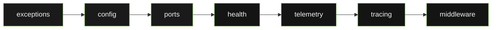
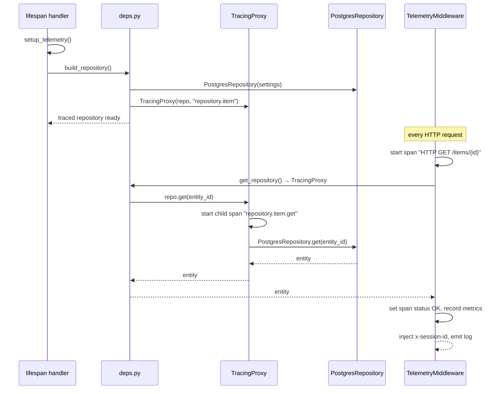

# System Architecture

`openframe-core` is a pure Python foundation package organised into seven modules with a strict one-way dependency order. No module imports from a module higher in the chain.

---

## Module Dependency DAG

Every arrow in this diagram is a permitted import direction. No reverse imports exist.

---

## Module Inventory

| Module | Public exports | External deps |
|---|---|---|
| `exceptions` | `AdapterError` + 5 subclasses | none |
| `config` | `BaseAdapterSettings` | `pydantic-settings` |
| `ports` | `BaseRepository[T]`, `BaseProducer[T]`, `BaseConsumer[T]` | none |
| `health` | `HealthCheck` | none |
| `telemetry` | `setup_telemetry`, `get_tracer`, `get_meter`, `record_lifecycle_event` | `opentelemetry-*` |
| `tracing` | `TracingProxy` | `opentelemetry-api` |
| `middleware` | `TelemetryMiddleware`, `ASGIScope`, `ASGIMessage`, `Receive`, `Send`, `ASGIApp` | `opentelemetry-api` |

---

## How a Template Uses openframe-core

The following sequence shows how a FastAPI template wires `openframe-core` at startup and serves a request.

---

## Deployment Topology

`openframe-core` is a library — it has no runtime process. It is installed as a dependency inside a Modal function container (or any other Python environment) and runs in-process with the application.

