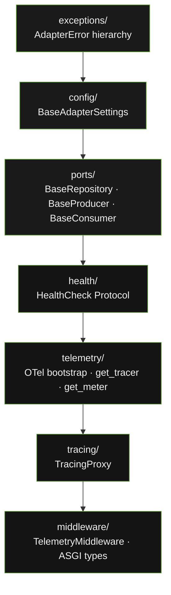

# System Overview

`openframe-core` is the foundation package of the OpenFrame Microservice Development Suite. It provides the structural contracts — ports, exceptions, config, tracing, telemetry, and middleware — that every adapter package in the ecosystem builds on.

---

## Seven-Module Model

The following diagram shows the seven modules inside `openframe-core` and the dependency order between them. Higher modules may import lower ones; the reverse is never permitted.

---

## Modules

### exceptions/

Defines `AdapterError` and five typed subclasses: `AdapterConnectionError`, `AdapterQueryError`, `AdapterNotFoundError`, `AdapterConfigurationError`, `AdapterTimeoutError`. Every adapter package raises only these — never raw driver exceptions. Services catch `AdapterError` as a single catch point regardless of which adapter is wired in.

### config/

`BaseAdapterSettings` is a Pydantic `BaseSettings` subclass. Every adapter's settings class inherits from it and declares its own fields. Env var reading, type coercion, and validation happen at instantiation time — misconfigured services fail at startup, not at first request.

### ports/

Three generic `runtime_checkable` Protocols: `BaseRepository[T]`, `BaseProducer[T]`, `BaseConsumer[T]`. Adapters satisfy these structurally — no inheritance required. Any class with matching async method signatures passes the protocol check.

### health/

`HealthCheck` Protocol with `ping()` (low-cost liveness) and `is_ready()` (full readiness). Every adapter implements both. Templates call `is_ready()` at startup and `ping()` on health check endpoints.

### telemetry/

Idempotent OTel SDK bootstrap. Configures OTLP trace and metric exporters when `OTEL_EXPORTER_OTLP_ENDPOINT` is set; falls back to no-op providers when absent. Provides `get_tracer()` and `get_meter()` via `@lru_cache`. `record_lifecycle_event()` replaces the template's platform-specific `record_cold_start()`.

### tracing/

`TracingProxy` is a zero-code async telemetry sidecar. It wraps any object and intercepts every async method call, creating a child OTel span with name `{prefix}.{method_name}`. Sync methods pass through unwrapped. The wrapped method is resolved fresh on every invocation — safe for reconnecting adapters.

### middleware/

`TelemetryMiddleware` is a pure ASGI middleware compatible with FastAPI, Starlette, Litestar, and bare ASGI. It records one OTel span and five HTTP metric instruments per request and injects an `x-session-id` response header. Also exports five stdlib-only ASGI type aliases (`ASGIScope`, `ASGIMessage`, `Receive`, `Send`, `ASGIApp`) shared across the ecosystem.

---

## Key Design Properties

- **Zero domain logic** — `openframe-core` knows nothing about items, users, or any business concept.
- **Zero infrastructure imports** — no FastAPI, no Modal, no driver imports. External dependencies are `opentelemetry-*`, `pydantic`, and `pydantic-settings` only.
- **Namespace package** — `openframe/__init__.py` uses `pkgutil.extend_path` so multiple installed packages contribute to the `openframe.*` namespace without conflict.
- **Stable contract** — the major version (`>=1.0,<2`) is the compatibility contract pinned by every other package in the ecosystem. Every public API decision is treated as permanent until a major version bump.
- **Platform-agnostic** — no Modal, AWS, GCP, or RunPod references. `OPENFRAME_ENV` replaces `MODAL_ENV`. Modal users map the variable in their own `configure_env_vars()`.
