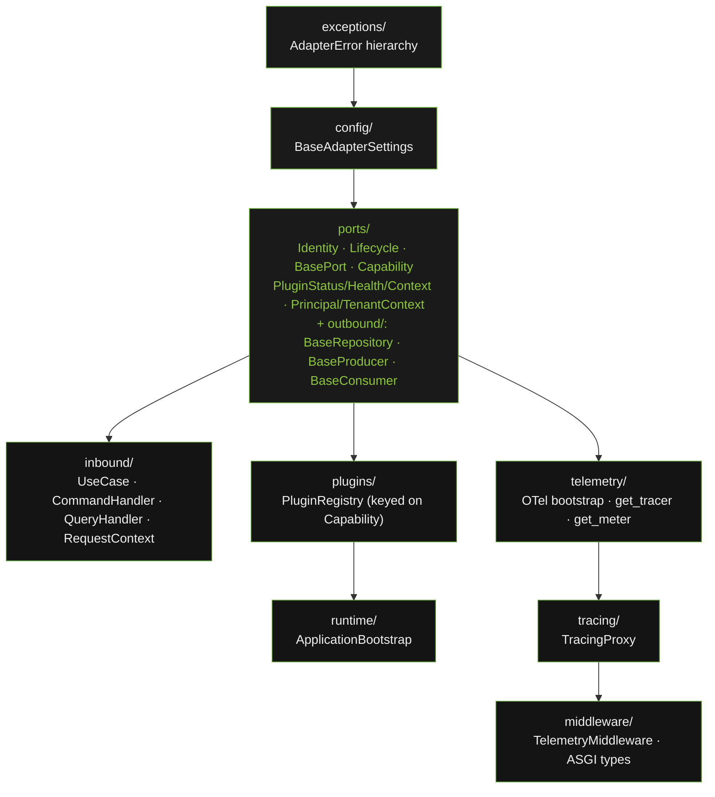

# System Overview

`openframe-core` is the foundation package of the OpenFrame Microservice
Development Suite. It provides the unified port + lifecycle contract layer
(ADR-006) — `ports` (including its `outbound/` sub-module), `inbound`,
`plugins`, plus the supporting `exceptions`, `config`, `tracing`,
`telemetry`, and `middleware` infrastructure — that every adapter package
in the ecosystem builds on.

---

## The Unified Contract Layer

`openframe-core` v3.0 replaced the pre-v3 three-way split (hardcoded
lifecycle-free ports + standalone `HealthCheck` + standalone
`OpenFramePlugin`) with a single contract family: `Identity` +
`Lifecycle` = `BasePort`. Every outbound port and every registrable plugin
is a `BasePort`. There is no separate plugin protocol and no standalone
health module. In v3.1.0, the previously separate `openframe.core.contracts`
module merged into `openframe.core.ports`, and the three outbound
protocols (`BaseRepository`, `BaseProducer`, `BaseConsumer`) moved into an
internal `ports/outbound/` sub-module mirroring `inbound/` on the driving
side — see
[ADR-006](../architecture/adrs/adr-006-unified-port-lifecycle.md) for the
full rationale and what it replaced.

---

## Modules

### exceptions/

Defines `AdapterError` and five typed subclasses: `AdapterConnectionError`, `AdapterQueryError`, `AdapterNotFoundError`, `AdapterConfigurationError`, `AdapterTimeoutError`. Every adapter package raises only these — never raw driver exceptions. Services catch `AdapterError` as a single catch point regardless of which adapter is wired in.

### config/

`BaseAdapterSettings` is a Pydantic `BaseSettings` subclass. Every adapter's settings class inherits from it and declares its own fields. Env var reading, type coercion, and validation happen at instantiation time — misconfigured services fail at startup, not at first request.

### ports/

The canonical, apex contract layer (ADR-006). `Identity` (`name`/`version`/`capability`) + `Lifecycle` (`initialize`/`shutdown`/`health`) compose into `BasePort` — the single base every outbound port extends and the single type the plugin registry accepts. `Capability` is a closed `str` enum taxonomy (`PERSISTENCE`, `CACHE`, `QUEUE`, `SECRETS`, `FLAGS`, `STORAGE`, `TRANSPORT`, `INFERENCE`, `EMBEDDING`, `SCHEDULE`, `SEARCH` — see [capability-taxonomy.md](../architecture/capability-taxonomy.md)). `PluginStatus`/`PluginHealth`/`PluginContext` are the canonical lifecycle status/health/init-context trio. `PrincipalContext`/`TenantContext` are frozen identity dataclasses threaded through both `PluginContext` (outbound) and `RequestContext` (inbound).

Its `outbound/` sub-module holds three generic `runtime_checkable` Protocols, each `BasePort` plus domain methods: `BaseRepository[T]`, `BaseProducer[T]`, `BaseConsumer[T]`. Adapters satisfy these structurally — no inheritance required. Every port is lifecycle-aware by definition; there is no lifecycle-free variant. All three remain importable from the top-level `openframe.core.ports` package; `outbound/` is an internal reorganisation, not a public API change. Future capability-specific outbound protocols (e.g. `BaseSecretsProvider` from `openframe-infra`) are added here.

### inbound/

The driving side of the hexagon. `UseCase[TInput, TOutput]` is the general driving contract; `CommandHandler[TInput]` and `QueryHandler[TInput, TOutput]` are its CQRS-flavoured specialisations. `RequestContext` (correlation id + optional `PrincipalContext`/`TenantContext`) is constructed by inbound adapters and passed into `execute()`.

### plugins/

`PluginRegistry` accepts any `BasePort` and keys `get()`/`get_all()` on the `Capability` enum. `get()` is strict — it raises `AmbiguousCapabilityError` when more than one port shares a capability, rather than silently returning the first match; use `get_all()` when that's the intended configuration. A "plugin" is just a registered `BasePort` — there is no separate plugin protocol.

### runtime/

`ApplicationBootstrap` is an optional composition root. Manages `PluginRegistry` registration and lifecycle (`configure` → `start` → `stop`), or as an async context manager.

### telemetry/

Idempotent OTel SDK bootstrap. Configures OTLP trace and metric exporters when `OTEL_EXPORTER_OTLP_ENDPOINT` is set; falls back to no-op providers when absent. Provides `get_tracer()` and `get_meter()` via `@lru_cache`. `record_lifecycle_event()` replaces the template's platform-specific `record_cold_start()`.

### tracing/

`TracingProxy` is a zero-code async telemetry sidecar. It wraps any object and intercepts every async method call, creating a child OTel span with name `{prefix}.{method_name}`. Sync methods pass through unwrapped. The wrapped method is resolved fresh on every invocation — safe for reconnecting adapters.

### middleware/

`TelemetryMiddleware` is a pure ASGI middleware compatible with FastAPI, Starlette, Litestar, and bare ASGI. It records one OTel span and five HTTP metric instruments per request and injects an `x-session-id` response header. Also exports five stdlib-only ASGI type aliases (`ASGIScope`, `ASGIMessage`, `Receive`, `Send`, `ASGIApp`) shared across the ecosystem.

### testing/

Reusable test doubles (`InMemoryRepository`, `FakeProducer`, `FakeConsumer` — all satisfy `BasePort`) and pytest contract-test base classes. `LifecycleContractTests` and `PortContractTests` are the shared `BasePort` conformance suite; `RepositoryContractTests`/`ProducerContractTests`/`ConsumerContractTests` build on `PortContractTests` and add domain-specific assertions.

---

## Key Design Properties

- **Zero domain logic** — `openframe-core` knows nothing about items, users, or any business concept.
- **Zero infrastructure imports** — no FastAPI, no Modal, no driver imports. External dependencies are `opentelemetry-*`, `pydantic`, and `pydantic-settings` only.
- **Namespace package** — `openframe/__init__.py` uses `pkgutil.extend_path` so multiple installed packages contribute to the `openframe.*` namespace without conflict.
- **One contract family, one canonical home per concept** — `ports/` is the sole source of `Identity`, `Lifecycle`, `BasePort`, `Capability`, `PluginStatus`/`PluginHealth`/`PluginContext`, and `PrincipalContext`/`TenantContext`, plus (in `ports/outbound/`) the capability-specific outbound protocols built on them. No duplicate definitions exist elsewhere in the package (ADR-006).
- **Major version is the compatibility contract** — each `openframe-core` major version (v3.0, v4.0) is an intentional breaking change with no deprecated aliases or shims. Downstream `openframe-adapters` packages continue resolving to their pinned major version until explicitly migrated.
- **Platform-agnostic** — no Modal, AWS, GCP, or RunPod references. `OPENFRAME_ENV` replaces `MODAL_ENV`. Modal users map the variable in their own `configure_env_vars()`.
